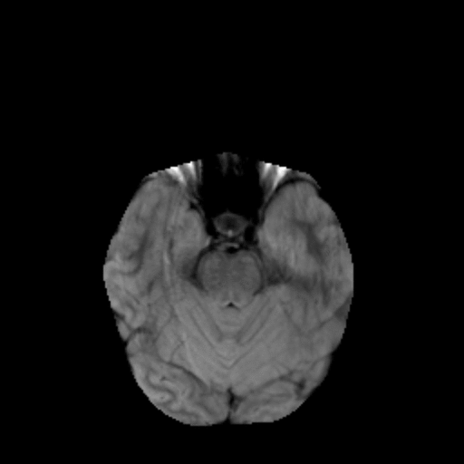
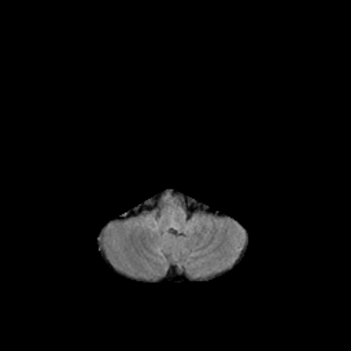
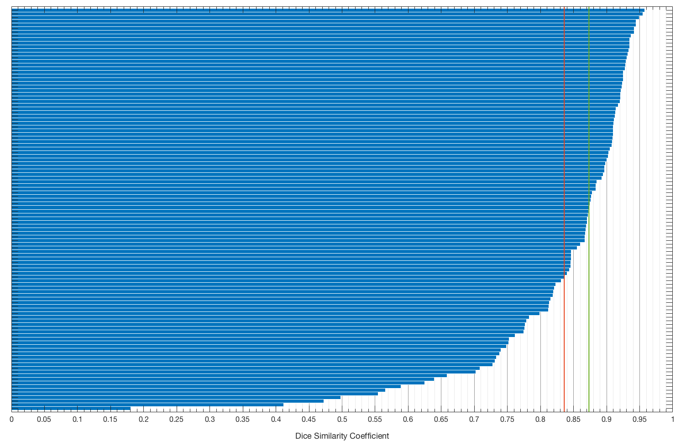

# Brain segmentation

This is a source code for the deep learning segmentation used in the paper `under review` by `authors`.
It employs a U-Net like network for skull stripping and FLAIR abnormality segmentation.
This repository contains a set of functions for data preprocessing (MatLab), training and inference (Python).
Weights for trained models are provided and can be used for deep learning based skull stripping or fine-tuning on a different dataset.
If you use our model or weights, please cite:

```
under review
```

The repository is divided into two folders.
One for skull stripping and one for the FLAIR abnormality segmentation.
They are based on the same model architecture but can be used separately.

## Prerequisites

- MatLab 2016b for pre-processing
- Python 2 with dependencies listed in the `requirements.txt` file
```
sudo pip install -r requirements.txt
```

## Results

Below we show qualitative results for the average and median case.
Blue outline corresponds to ground truth and red to the final automatic segmentation output.
Images show FLAIR modality after preprocessing and skull stripping.

| Average Case | Median Case |
|:----------:|:---------:|
|||

The distribution of Dice similarity coefficient (DSC) for the whole dataset of 110 cases used in our study.



The red vertical line corresponds to mean DSC (83.60%) and the green one to median DSC (87.33%).

## Trained weights

To download trained weights use `download_weights.sh` script located in both skull stripping or flair segmentation folder.
It downloads *.h5 file with weights corresponding to training log shown in each task specific folder and responsible for the results reported there.

## U-Net architecture

The figure below shows a U-Net architecture implemented in this repository.


## Data


```
https://www.kaggle.com/mateuszbuda/lgg-mri-segmentation
```
