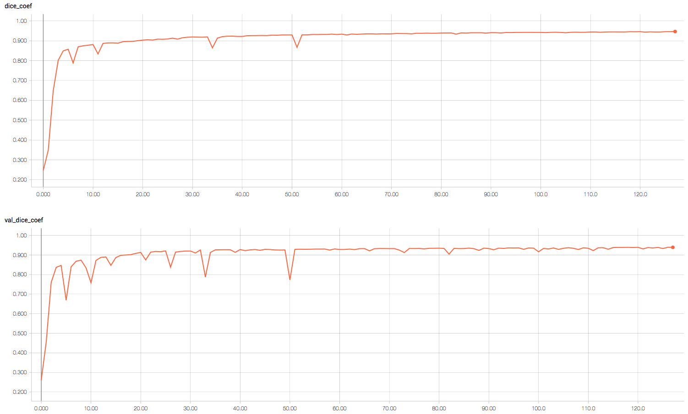
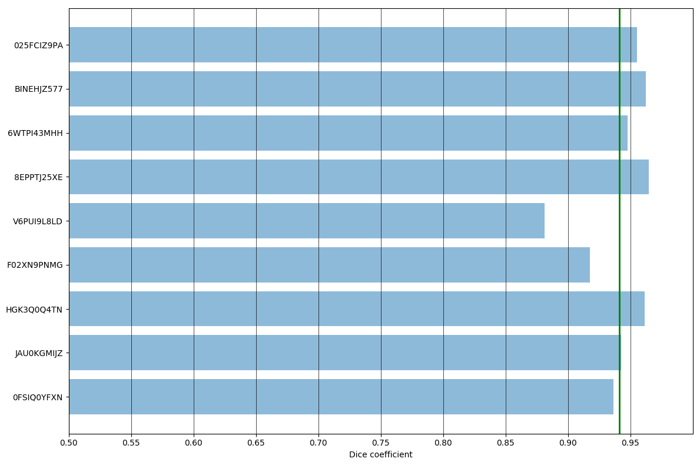
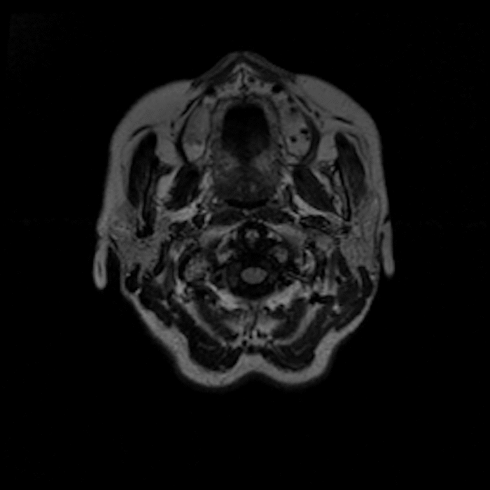
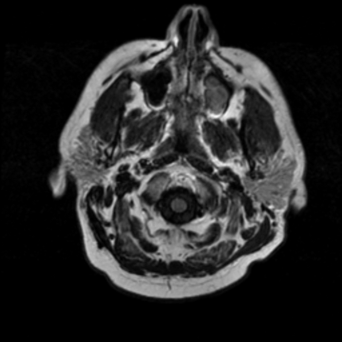

## Deep learning based skull stripping

This folder contains an implementation of our deep learning based skull removal algorithm based on FLAIR modality MRI.

### Usage

#### Preprocessing
You need to have a folder with images preprocessed using provided matlab function `preprocessing3D.m`.
It rescales them to have spacial dimensions 256x256 and performs contrast normalization.
Refer to the documentation of `preprocessing3D.m` function for more details.
The main requirement for the following steps is to have image names in format `<case_id>_<slice_number>.tif` and corresponding masks named `<case_id>_<slice_number>_mask.tif`.

#### Training
The training script `train.py` has variables defined at the top that you need to set:

- `train_images_path` - folder containing training images
- `valid_images_path` - folder containing validation images
    
Other variables can be changed to adjust some training parameters.
Then, run the training using
```
python train.py
```

#### Testing
To run the inference, you need to setup some variables defined at the top of the `test.py` script:

- `weights_path` - path to the trained weights
- `train_images_path` - folder containing training images to compute the mean and standard deviation for data normalization; if you pass your own  mean and standard deviation to the `test` function, this variable is not used
- `test_images_path` - folder with test images for prediction; it must contain corresponding mask files as well, however, they can be dummy (all zeros)
- `predictions_path` - folder for saving predicted and ground truth segmentation outlines (will be created if it doesn't exist)

When all variables are setup, run the inference using
```
python test.py
```

### Results

Training log for a single random 10% train/test split:



The average Dice similarity coefficient (DSC) for this split was 94.11%.
The distribution of DCS is shown below.



And quantitative results for the worst and best case from the test set.
Notice that the deep learning based segmentation is actually better than the ground truth which was generated using another automatic segmentation tool.




